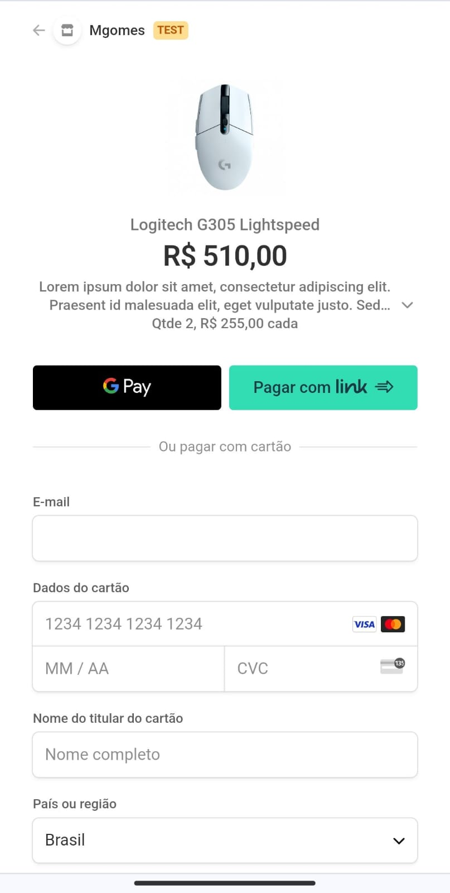

# E-commerce de loja de produtos de informática

Site de venda de mouses, teclados, headphones, etc com sistema de pagamentos, salvamento de carrinho, resgate de pedidos anteriores e login.

**Variáveis de ambiente**
Altere o arquivo '.env-example' para '.env', e insira as seguintes variáveis de ambiente:
```
DATABASE_URL=
GOOGLE_CLIENT_ID=
GOOGLE_CLIENT_SECRET=
NEXTAUTH_SECRET=
NEXT_PUBLIC_STRIPE_PUBLIC_KEY=
STRIPE_SECRET_KEY=
STRIPE_WEBHOOK_SECRET_KEY=
HOST_URL=
```

## Run
**Instale as dependências**
```
npm install
```


## Principais tecnologias e bibliotecas implementadas:
1) Typescript
2) React (com hooks de useContext, useEffect, useState, etc)
5) Tailwindcss para estilos padronizados
6) Componentização para código limpo e de fácil manutenção
7) Spride (para pagamentos)
8) NextAuth (para login)
9) Supabase (banco de dados) c/ postgresql

## App Screenshots

|                A               |                B               |                C               |
| :----------------------------: | :----------------------------: | :----------------------------: |
|      |   |      |
|  |   | |
|   |  | |


### Link da vercel: https://gamatech-store.vercel.app/
